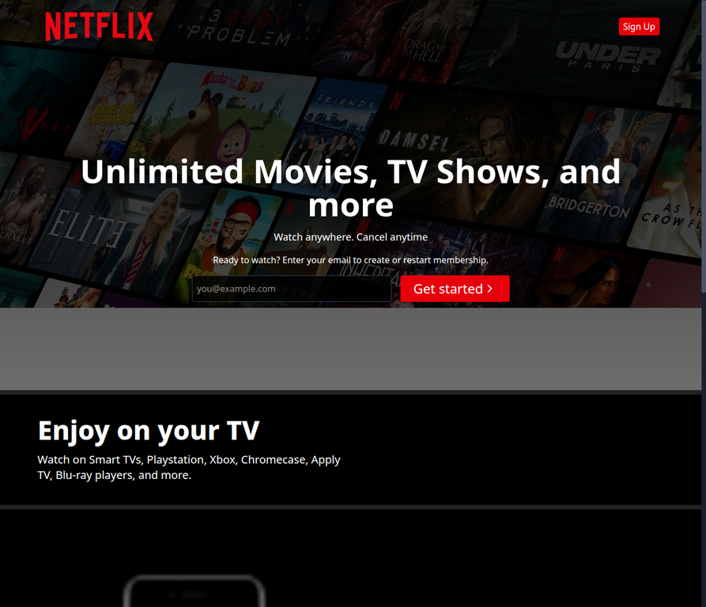
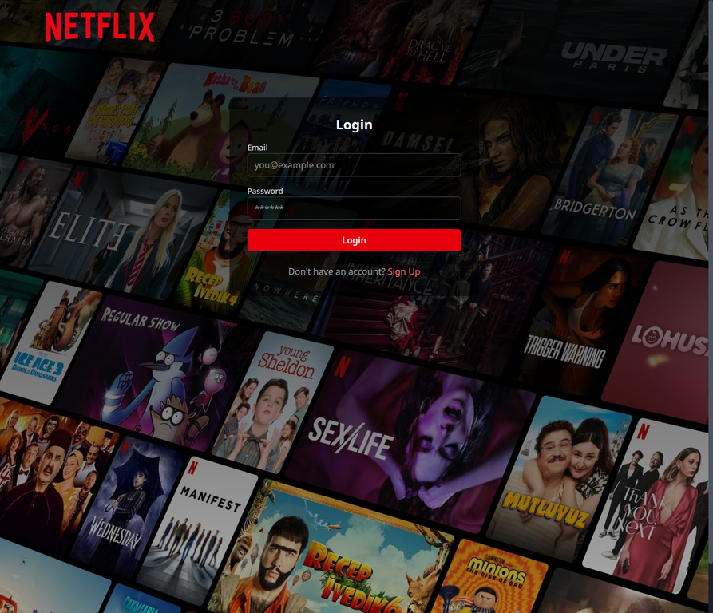
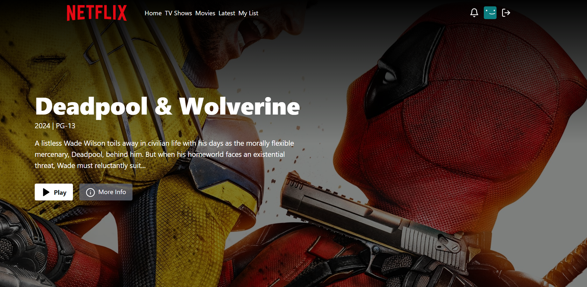

<div align="center">

# 🎬 Netflix Full-Stack Clone 

[](https://netflix-clone-production-118c.up.railway.app)
[](LICENSE)
[](https://react.dev/)
[](https://nodejs.org/)
[](https://tailwindcss.com/)

A feature-rich, full-stack **Netflix Clone** application replicating the core streaming platform experience. Built with modern web technologies, featuring secure user authentication, TMDB API integration for real-time movies and TV shows, trailer playback, search history tracking, and a fully responsive cinematic UI.

[Explore Live Demo](#-live-demo) • [Key Features](#-key-features) • [Tech Stack](#️-tech-stack) • [Getting Started](#-getting-started) • [Deployment](#-deployment)

</div>

---

## 🌟 Live Demo

Experience the live application deployed on Railway:

> **🔗 [https://netflix-clone-production-118c.up.railway.app](https://netflix-clone-production-118c.up.railway.app)**

---

## 📸 Screenshots

| Landing Page | Authentication (Sign In / Up) |
| :---: | :---: |
|  |  |
| *Cinematic landing page with dynamic feature showcases.* | *Secure user authentication with JWT and cookie sessions.* |

| Browse & Discover (Home) | Watch Trailer & Details |
| :---: | :---: |
|  |  |
| *Immersive home dashboard featuring trending content and categories.* | *Detailed watch view with embedded trailers and metadata.* |

---

## ✨ Key Features

- **🔐 Secure Authentication & Authorization**: Complete user sign-up, login, and logout flow backed by JSON Web Tokens (JWT), HTTP-only cookies, and bcrypt password hashing.
- **🎥 TMDB API Integration**: Dynamic fetching of trending movies, popular TV shows, categories, trailers, and detailed cast/crew metadata in real-time.
- **▶️ Cinematic Watch Experience**: Interactive watch pages supporting embedded video trailers, episode lists, and recommended titles.
- **🔍 Advanced Search & History**: Robust search functionality across movies and TV series, complete with persistent search history tracking.
- **⚡ Modern Responsive UI**: Pixel-perfect replication of Netflix's design system using Tailwind CSS, featuring smooth carousels, custom scrollbars, and dark-mode styling.
- **🛡️ Protected Routes**: Client-side and server-side route guarding ensuring unauthorized users cannot access protected streaming dashboards.

---

## 🛠️ Tech Stack

### **Frontend**
- **Library**: [React 19](https://react.dev/) with Vite
- **Styling**: [Tailwind CSS v4](https://tailwindcss.com/) & `tailwind-scrollbar-hide`
- **State Management**: [Zustand](https://github.com/pmndrs/zustand)
- **Routing**: [React Router v7](https://reactrouter.com/)
- **HTTP Client**: [Axios](https://axios-http.com/)
- **UI Icons & Notifications**: `lucide-react`, `react-hot-toast`, `react-player`

### **Backend**
- **Runtime**: [Node.js](https://nodejs.org/) & [Express.js](https://expressjs.com/)
- **Database & ODM**: [MongoDB](https://www.mongodb.com/) & [Mongoose](https://mongoosejs.com/)
- **Authentication**: `jsonwebtoken`, `bcryptjs`, `cookie-parser`
- **Environment & Utilities**: `dotenv`, `cross-env`, `nodemon`

---

## 📁 Project Architecture

```text
netflix-clone/
├── backend/
│   ├── controllers/   # Request handlers (auth, movie, tv, search)
│   ├── db/            # Database connection configuration
│   ├── middlewares/   # Route protection & authentication guards
│   ├── models/        # Mongoose database schemas (User, etc.)
│   ├── routes/        # Express API routers
│   ├── services/      # External API service integrations (TMDB)
│   ├── utils/         # Helper utilities (JWT token generation)
│   └── server.js      # Express app entry point
├── frontend/
│   ├── public/        # Static assets, images, and logos
│   ├── src/
│   │   ├── components/# Reusable UI components (Navbar, Footer, Slider)
│   │   ├── hooks/     # Custom React hooks (trending content, etc.)
│   │   ├── pages/     # View pages (Home, Auth, Search, Watch)
│   │   ├── store/     # Zustand state stores
│   │   ├── utils/     # Frontend constants and helper functions
│   │   ├── App.jsx    # Root component with route declarations
│   │   └── main.jsx   # React DOM mounting
│   └── vite.config.js # Vite configuration
└── package.json       # Root dependency management and build scripts
```

---

## 🚀 Getting Started

Follow these instructions to set up and run the project locally on your machine.

### **Prerequisites**
Ensure you have the following installed on your system:
- **Node.js** (v18 or higher recommended)
- **npm** or **pnpm**
- **MongoDB** instance (Local URI or MongoDB Atlas connection string)
- **TMDB API Key** (Get a free key from [The Movie Database](https://www.themoviedb.org/settings/api))

### **1. Clone the Repository**
```bash
git clone https://github.com/AihamJassar/netflix-clone.git
cd netflix-clone
```

### **2. Install Dependencies**
Install dependencies for both the root backend and the frontend application:
```bash
# Install root (backend) dependencies
npm install

# Install frontend dependencies
npm install --prefix frontend
```

### **3. Environment Configuration**
Create a `.env` file in the root directory and configure your environment variables:
```env
PORT=5000
MONGO_URI=your_mongodb_connection_string_here
JWT_SECRET=your_super_secret_jwt_key_here
JWT_EXPIRATION=your_expiration_jwt_date_here
NODE_ENV=development
TMDB_API_KEY=your_tmdb_api_key_here
```

### **4. Run the Application**

#### **Development Mode** (Runs backend with nodemon and frontend Vite dev server concurrently)
```bash
# Start backend server
npm run dev

# In a separate terminal, start the frontend dev server
npm run dev --prefix frontend
```

#### **Production Build**
```bash
# Build both frontend and backend for production
npm run build

# Start production server
npm start
```

---

## 🚢 Deployment

The application is optimized for deployment on modern cloud platforms such as **Railway**, **Render**, or **Vercel** (with a separate backend host).

### **Deploying to Railway**
1. Fork or push this repository to your GitHub account.
2. Create a new project on [Railway](https://railway.app/) and select **Deploy from GitHub repo**.
3. Choose your `netflix-clone` repository.
4. Add the required environment variables in the Railway project dashboard:
   - `MONGO_URI`
   - `JWT_SECRET`
   - `TMDB_API_KEY`
   - `NODE_ENV=production`
5. Railway will automatically detect the root `package.json` build and start scripts:
   - **Build Command**: `npm install && npm install --prefix frontend && npm run build --prefix frontend`
   - **Start Command**: `npm start`
6. Once deployment completes, Railway will provide your live production URL (e.g., `https://your-app.up.railway.app`).

---

## 👤 Author

**Aiham Jassar**
- GitHub: [@AihamJassar](https://github.com/AihamJassar)

---

## 📝 License

This project is open-source and available under the [ISC License](LICENSE).